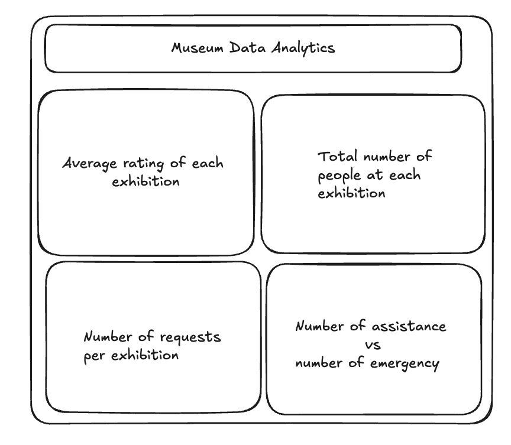
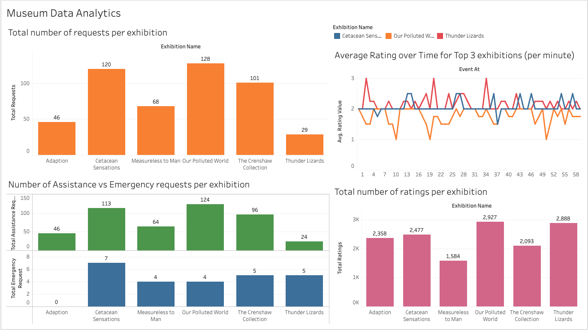

# Kafka Message Consumer 

This script reads real-time messages from a Kafka cluster, cleans the data, and loads it into an Amazon RDS database.

## Table of Contents
- [Installation](#installation)
- [Usage](#usage)
- [Configuration](#configuration)
- [Logging](#logging)
- [Functions](#functions)
- [Dashboard](#dashboard)

## Installation

1. **Clone the repository**:
```bash
git clone https://github.com/yourusername/repository-name.git
cd repository-name
```

2. **Install the required packages**

You can create a virtual environment and install the dependencies using pip:

```python -m venv .venv```.
```source .venv/bin/activate```  # On Windows use `.venv\Scripts\activate`.
```pip install -r requirements.txt```.

3. **Create a ```.env``` file**

Add your Kafka and database connection details in a ```.env``` file:
```
BOOTSTRAP_SERVERS=your_kafka_server
SECURITY_PROTOCOL=your_security_protocol
SASL_MECHANISM=your_sasl_mechanism
USERNAME=your_username
PASSWORD=your_password
DB_NAME=your_db_name
DB_USERNAME=your_db_username
DB_PASSWORD=your_db_password
DB_IP=your_db_ip
DB_PORT=your_db_port 
```

## Usage

Run the script to start consuming messages from a Kafka cluster:

```python3.12 consumer.py [-l[--log]]``` 
    
- The ```-l``` or ```--log``` flag disables logging of invalid messages to a log file.

## Configuration

The script uses the following global variables defined in ```global_variables.py```:

- ```GROUP_ID```: Consumer group ID for the Kafka consumer.
- ```TOPIC```: Kafka topic to subscribe to.
- ```POLL_TIME```: Time in milliseconds to wait for new messages.
- ```MIN_RATING```, ```MAX_RATING```: Valid range for the 'val' field.
- ```REQUEST_SCORE```: Score that indicates a request interaction.
- ```NUM_OF_EXHIBITIONS```: Set of valid exhibition site numbers.
- ```ACCEPTABLE_TYPES```: Set of valid types for requests.
- ```LOGGER_FILE_NAME```: Name of the log file to store invalid messages.

## Logging

If logging is enabled, invalid messages will be recorded in the specified log file (```invalid_messages.log```) with a timestamp and error description. You can adjust the logging level in the ```setup_logger``` function.

## Functions

### Key Functions

- ```parse_arguments()```: Parses command line arguments.
- ```setup_logger(log_file, log_level)```: Configures and returns a logger.
- ```create_consumer(config)```: Creates and configures a Kafka consumer.
- ```decode_message(msg)```: Decodes a Kafka message.
- ```validate_keys(data)```: Validates the keys in the Kafka message.
- ```process_message(msg)```: Processes a Kafka message and validates its keys.
- ```upload_to_database(connect, db_cursor, message)```: Uploads validated data to the database.

## Dashboard

The dashboard will provide a visual representation of the data processed from the Kafka messages. 

### Wireframe

Below is the wireframe design:



### Dashboard

Below is the dashboard design:

